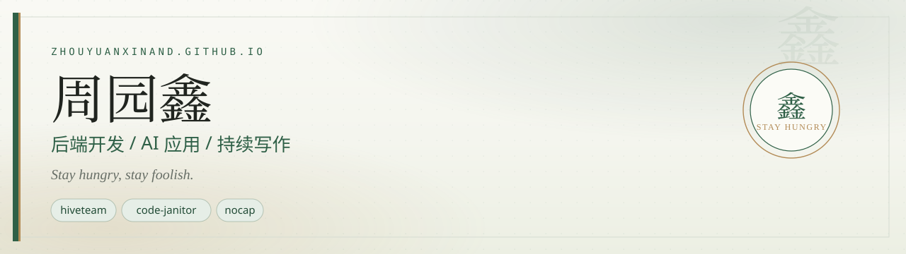

  
  

    
    
    
    
  

---

### 🚀 代表作 / Featured Projects

<table>
  <tr>
    <td width="33%" valign="top">
      <h4 align="center">🐝 hiveteam</h4>
      
<strong>AI 编码代理集体智慧</strong>

      
面向 CLI 编码代理的浏览器原生集体智慧——Claude Code、Codex、Gemini 和 OpenCode 以团队协议作为真正的 PTY 进程协作。

      

        
        
        
      

    </td>
    <td width="33%" valign="top">
      <h4 align="center">🧹 code-janitor</h4>
      
<strong>AI 代码清理</strong>

      
找出并移除 AI 生成的无效代码，让代码仓库重新变得干净、可读。

      

        
        
        
      

    </td>
    <td width="33%" valign="top">
      <h4 align="center">🧢 nocap</h4>
      
<strong>AI 代理“测谎仪”</strong>

      
AI 编码代理的验收测谎仪——运行收据核对，当场戳穿“已完成”的谎言。

      

        
        
        
      

    </td>
  </tr>
</table>

---

### 🧰 技术栈 / Tech Stack

  

---

### 💼 工作经历 / Experience

<table>
  <tr>
    <td width="72" align="center" valign="middle"></td>
    <td valign="middle"><b>神州数码集团</b></td>
    <td valign="middle">Agent 开发工程师</td>
    <td align="right" valign="middle">2026.06 — 至今</td>
  </tr>
  <tr>
    <td width="72" align="center" valign="middle"></td>
    <td valign="middle"><b>时代共赢私募基金</b></td>
    <td valign="middle">量化开发工程师</td>
    <td align="right" valign="middle">2026.03 — 2026.06</td>
  </tr>
  <tr>
    <td width="72" align="center" valign="middle"></td>
    <td valign="middle"><b>AIA</b> 友邦保险集团全球技术创新中心</td>
    <td valign="middle">AI 应用开发实习生 · RD 部门</td>
    <td align="right" valign="middle">2025.12 — 2026.03</td>
  </tr>
  <tr>
    <td width="72" align="center" valign="middle"></td>
    <td valign="middle"><b>美团</b></td>
    <td valign="middle">测试开发实习生 · 支付质量组</td>
    <td align="right" valign="middle">2024.08 — 2025.09</td>
  </tr>
  <tr>
    <td width="72" align="center" valign="middle"></td>
    <td valign="middle"><b>百词斩</b></td>
    <td valign="middle">后端开发实习生 · 业务平台组</td>
    <td align="right" valign="middle">2024.05 — 2024.08</td>
  </tr>
</table>

  <picture>
    <source media="(prefers-color-scheme: dark)" srcset="https://raw.githubusercontent.com/zhouyuanxinand/zhouyuanxinand/output/github-snake-dark.svg" />
    
  </picture>

  <i>贪吃蛇由 <a href="scripts/generate-snake.js">generate-snake.js</a> 每日自动生成（视觉灵感来自 <a href="https://github.com/Platane/snk">Platane/snk</a>）。</i>

